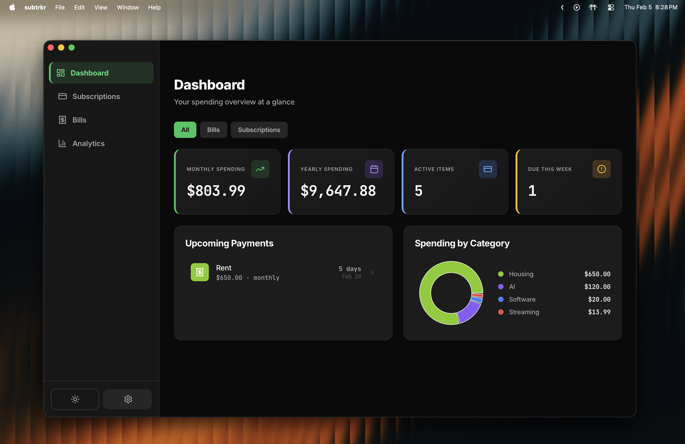
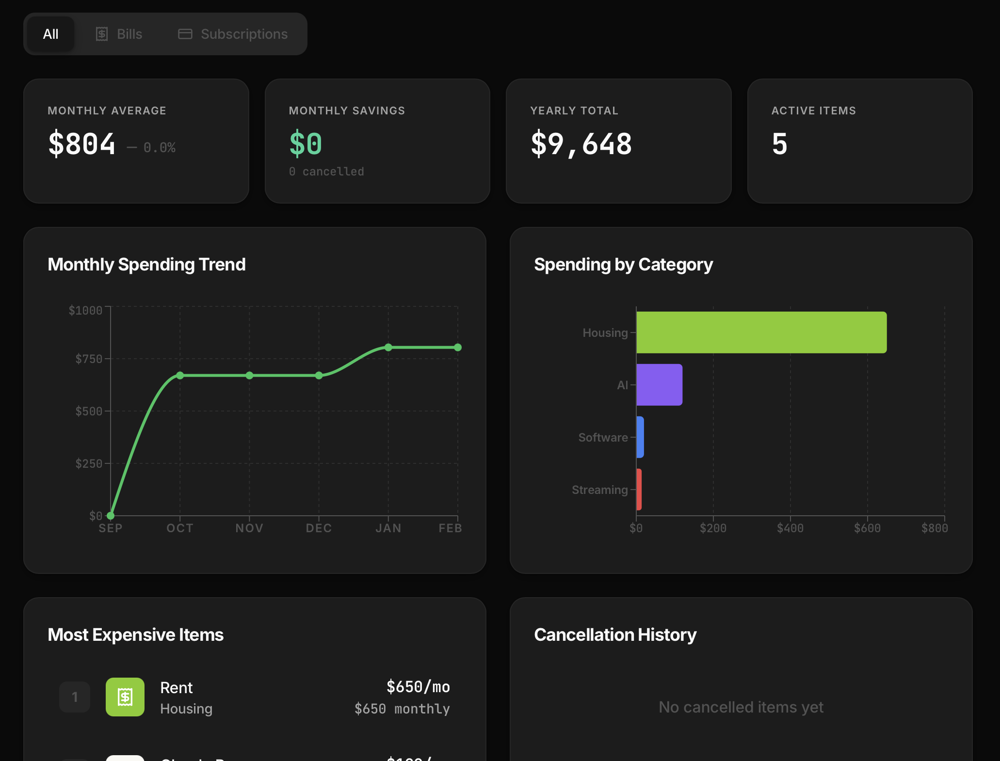
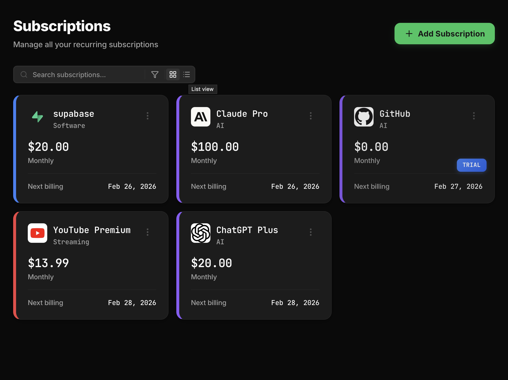

# SubTrkr

<div align="center">

**Tired of subscriptions weighing you down?**

*Take back control. Know exactly what you're paying for, when, and why.*

[](https://tauri.app)
[](https://supabase.com)
[](https://www.typescriptlang.org/)

<br/>



*Your subscription spending, crystal clear.*

</div>

---

## Why SubTrkr?

The average person juggles **12+ subscriptions**. Netflix, Spotify, GitHub, Adobe, that gym membership you forgot about—they add up fast. Most people **underestimate their monthly spend by 30-40%**.

SubTrkr solves this by giving you:

- 📊 **Crystal-clear visibility** into your recurring payments
- 🔔 **Smart notifications** before renewals hit your account
- 💰 **Instant insights** on where your money actually goes
- 🔐 **Secure sync** across all your devices
- ⚡ **Blazing-fast performance** with native desktop power

Stop bleeding money on forgotten subscriptions. Start making informed decisions.

---

## 📸 See It In Action

<table>
<tr>
<td width="50%">

### 📊 Analytics & Insights
Track spending trends, identify patterns, and see where your money goes with beautiful visualizations.



</td>
<td width="50%">

### 💳 Subscription Management
Manage all your subscriptions in one place. See upcoming bills, track trials, and never miss a renewal date.



</td>
</tr>
</table>

---

## ✨ What You Get

<div align="center">

| 💰 Financial Clarity | 🔔 Smart Alerts | 📈 Visual Insights | 🔐 Secure & Private |
|:---:|:---:|:---:|:---:|
| See monthly, yearly, and lifetime spending at a glance | Get notified before renewals hit | Beautiful charts show spending trends | Bank-level encryption with Supabase |
| Track active subscriptions and trials | Never forget to cancel a trial | Category breakdowns and comparisons | Multi-factor authentication |
| Identify your most expensive subscriptions | Customizable reminder settings | Monthly spending trend analysis | Social login (Google, GitHub) |

</div>

---

## ✨ Features

### 📊 Core Tracking
- **Smart categorization** — Organize by Entertainment, Software, Health, Housing, and more
- **Renewal reminders** — Never get surprised by an unexpected charge
- **Cost analytics** — Monthly, yearly, and per-category insights
- **Trial tracking** — Keep tabs on free trials before they convert
- **Multi-subscription view** — Cards, lists, or whatever works for you

### 🎨 Modern Experience
- **Instant sync** — Your data follows you across devices
- **Dark mode UI** — Easy on the eyes, beautiful to use
- **Native performance** — Desktop-grade speed with Tauri
- **Secure authentication** — Email/password, Google, or GitHub sign-in
- **Email verification** — Enterprise-grade account security

### 🛠️ Developer Experience
- **Built with Tauri** — Rust-powered performance, <5MB bundle size
- **Real-time database** — Powered by Supabase PostgreSQL
- **Type-safe** — End-to-end TypeScript for zero runtime surprises
- **Lightning-fast builds** — Bun for sub-second dependency installs
- **Row-level security** — Your data is isolated and protected

---

## 🚀 Quick Start

```bash
# Clone the repository
git clone https://github.com/yourusername/SubTrkr.git
cd SubTrkr

# Install dependencies (requires Bun)
bun install

# Set up environment variables
cp .env.example .env
# Add your Supabase credentials to .env

# Start development server
bun tauri dev

# Build for production
bun tauri build
```

---

## 🛠️ Tech Stack

SubTrkr combines the best of modern web and native technologies:

| Layer | Technology | Why |
|-------|-----------|-----|
| **Frontend** | React + TypeScript | Type-safe, component-driven UI |
| **Desktop Runtime** | Tauri (Rust) | Native performance, tiny bundle size |
| **Database** | Supabase (PostgreSQL) | Real-time sync, RLS security |
| **Authentication** | Supabase Auth | Social login, email verification |
| **Package Manager** | Bun | Lightning-fast installs & builds |
| **Notifications** | Tauri Notifications API | Native OS integration |

---

## 💻 Development

### Prerequisites

Before you begin, ensure you have:

- [Rust](https://rustup.rs/) 1.70+
- [Node.js](https://nodejs.org/) 18+
- [Bun](https://bun.sh/) latest
- A [Supabase](https://supabase.com) account (free tier works!)

### Environment Setup

Create a `.env` file with your Supabase credentials:

```bash
VITE_SUPABASE_URL=your-project-url
VITE_SUPABASE_ANON_KEY=your-anon-key
```

### IDE Recommendations

**VS Code Extensions:**
- [Tauri](https://marketplace.visualstudio.com/items?itemName=tauri-apps.tauri-vscode) — Tauri-specific tooling
- [rust-analyzer](https://marketplace.visualstudio.com/items?itemName=rust-lang.rust-analyzer) — Rust language support
- [ESLint](https://marketplace.visualstudio.com/items?itemName=dbaeumer.vscode-eslint) — Code quality
- [Prettier](https://marketplace.visualstudio.com/items?itemName=esbenp.prettier-vscode) — Code formatting

### Project Structure

```
SubTrkr/
├── src/                    # React frontend
│   ├── components/         # UI components
│   ├── services/          # Business logic (auth, db, notifications)
│   └── App.tsx            # Main application
├── src-tauri/             # Rust backend
│   ├── src/               # Tauri application code
│   └── capabilities/      # Tauri permissions & config
├── supabase/
│   └── migrations/        # Database schema & migrations
└── package.json
```

---

## 🎯 Roadmap

- [ ] Budget alerts & spending limits
- [ ] Trial tracking (avoid forgetting to cancel!)
- [ ] Shared subscriptions (family plans, split payments)
- [ ] Export to CSV/PDF
- [ ] Mobile companion app
- [ ] Browser extension for automatic detection

---

## 🤝 Contributing

Contributions are welcome! Whether it's:

- 🐛 Bug reports
- 💡 Feature requests
- 📝 Documentation improvements
- 🔧 Code contributions

Check out the [issues](https://github.com/yourusername/SubTrkr/issues) to get started.

---

## 📄 License

MIT © [Your Name]

---

<div align="center">

**Built with care for people tired of subscription chaos.**

[Report Bug](https://github.com/yourusername/SubTrkr/issues) · [Request Feature](https://github.com/yourusername/SubTrkr/issues) · [Discussions](https://github.com/yourusername/SubTrkr/discussions)

</div>
